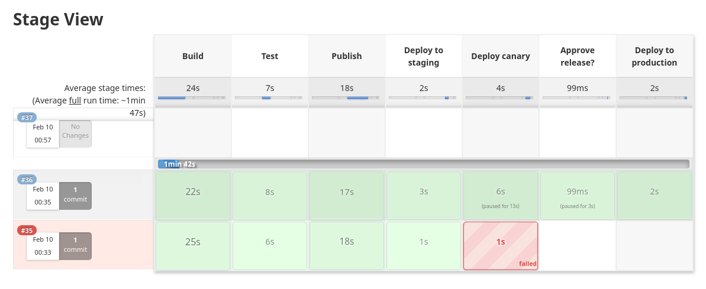

# jenkins-sandbox
Jenkins multibranch pipeline example, designed to work with k8s.

Provides following steps:
- Build - prepare docker image
- Test - run unit tests and publish report
- Publish - publish docker image 
- Deploy to staging
- Canary deploy 
- Production deploy - through the manual approve

